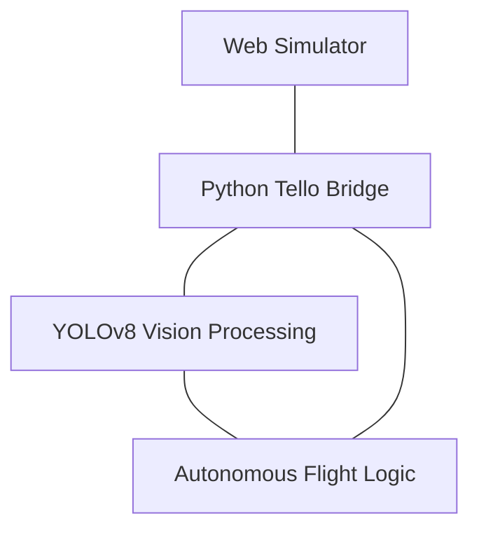

# 🛸 Tello OS: Next-Gen Drone Simulation & AI Ecosystem

  
  
  
  
  

  <b>A professional-grade, high-fidelity 3D drone simulator integrated with YOLOv8 Intelligence.</b> 
  Test autonomous flight logic, computer vision detection, and custom parkour designs in a zero-risk virtual hangar.

---

## 🚀 V2.0 REVOLUTION: NEW DETAILED FEATURES

With this version, the simulation has evolved from a visual tool into a fully integrated AI development platform. Here are the core innovations changing the heart of the project:

### ⚡ Remote Autonomous Launch (Synchronization)
There is now perfect synchronization between the Python AI and the Web world. The moment you press the **'T'** key in the browser, the system sends a "Start" signal to the AI engine via the Python bridge. This allows the drone to take off in the simulation while the YOLOv8 engine simultaneously begins sign detection and autonomous decision-making. Manual intervention is no longer required!

### 🚁 Professional-Grade 3D GLB Model Integration
Simple box models have been replaced by a high-detail **GLB 3D Drone** model. This model offers more than just a visual upgrade; it provides a realistic flight experience with propellers that spin according to speed, an FPV camera perfectly aligned with the flight axis, and physics-based gliding effects.

### 🎨 Advanced Object Designer & Elevation (Y-Axis) System
Designing parkour courses is now much more complex and realistic. With the new **ELEVATION (Y-Axis)** slider in the designer panel, you can position objects at any altitude instead of just on the ground. This feature allows for true testing of the drone's "Move Up" and "Move Down" commands. Additionally, you can personalize the course by uploading custom images (via URL or local file) to any object.

### 🧠 Integrated AI Analysis View (Remote Stream)
No need to wonder how the drone makes autonomous decisions. Frames processed by the YOLOv8 engine, complete with detection boxes and confidence scores, stream instantly to the web UI. Through the **AI ANALYSIS** window on the left sidebar, you can track how the AI "locks" onto signs without ever needing to look at the Python terminal window.

### 💡 Interactive Tips & Documentation System
A sleek **GUIDE** panel has been added to the top-left to help you discover the full depth of the simulator. This paginated panel explains everything from flight controls to hidden tricks like the **ALT + Drag** (Quick Elevation Adjustment) maneuver in a user-friendly way. It remains hidden by default and can be toggled via the "?" button.

### 📍 Dynamic Real-time Waypoint Pathing
When you move an object or change its elevation, the neon-blue dashed flight path updates automatically in real-time. This ensures you can always see the exact route the drone will take in the 3D world, reducing the margin of error in your mission designs.

---

## 📽️ VISUAL JOURNEY

  <h3>Simulator Environment</h3>
  
<i>High-fidelity 3D parkour with real-time physics and collision detection.</i>

  

 

  <h3>AI Computer Vision</h3>
  
<i>Real-time YOLOv8 sign detection and autonomous hazard avoidance.</i>

  

---

## 🏗️ SYSTEM ARCHITECTURE

---

## 🎮 CONTROL CENTER

| Action | Control |
| :--- | :--- |
| **Move Object** | Left Click + Drag (Ground) |
| **Elevate Object** | **ALT + Left Click + Drag** (Vertical) |
| **Remote Launch** | **T Key** (Syncs Web & AI) |
| **Land Drone** | **L Key** |
| **Rotate Camera** | Left Click (Empty Space) |
| **Reset Simulation** | **F5** |

---

## 🚀 QUICK START

1. **Web Terminal:** `npm install && npm run dev`
2. **AI Intelligence:** `python sim_test.py`

---

  <small>Built for Drone Innovation, CV Research & Professional Simulations</small>

