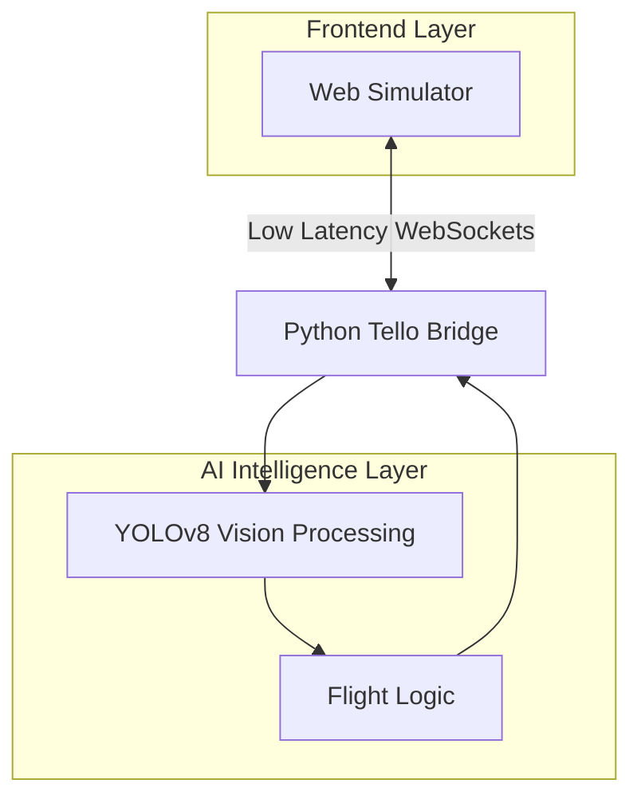

# 🛸 Tello-Web: Autonomous Drone Simulation

<div align="center">
  
  
  
  
</div>

<p align="center">
  <b>A professional-grade 3D drone simulator and autonomous control ecosystem.</b><br />
  Designed for zero-risk testing of AI-driven drone missions and computer vision research.
</p>

---

## 🌐 Overview
**Tello-Web** is a comprehensive simulation platform designed to bridge the gap between virtual development and real-world DJI Tello drone missions. By utilizing **Three.js** for a physics-accurate 3D environment and **YOLOv8** for real-time computer vision, it provides a robust testing ground for autonomous flight algorithms.

---

## 📽️ Visual Journey

<div align="center">
  <h3>Simulator Environment</h3>
  <p><i>High-fidelity 3D parkour with real-time physics and collision detection.</i></p>
  
</div>

<br />

<div align="center">
  <h3>AI Computer Vision</h3>
  <p><i>Real-time YOLOv8 sign detection and autonomous hazard avoidance.</i></p>
  
</div>

---

## ✨ Key Features

- **Professional Physics:** Real-time drone dynamics and collision handling powered by Three.js.
- **Autonomous Navigation:** AI-driven sign and hazard detection using YOLOv8.
- **Mission Editor:** Integrated drag-and-drop tool for custom course creation.
- **Low Latency:** High-speed WebSocket bridge for seamless FPV video streaming.
- **Map Persistence:** Save and load your custom mission layouts via LocalStorage.

---

## 🏗️ System Architecture

The project is divided into two main layers communicating over a low-latency bridge.



---

## 🔬 Technical Deep Dive

### 1. 🕹️ 3D Simulator (The Environment)
Handles accurate flight physics, 720p virtual FPV camera streaming, and real-time collision detection.

### 2. 🧠 Intelligence Layer (The Brain)
Utilizes **YOLOv8 Nano** to detect directional signs and hazards. It processes frames and calculates movement vectors in real-time.

### 3. 🛰️ Autonomous Flight Logic
The system follows a continuous loop: **Frame Capture** → **Object Detection** → **Target Locking** → **Vector Calculation** → **Maneuver Execution**.

---

## 📊 Performance Specs

| Metric | Target | Status |
| :--- | :--- | :--- |
| Video Stream | 30 FPS | ✅ Stable |
| AI Inference | < 25ms | ✅ Real-time |
| Latency | < 10ms | ✅ Ultra-low |

---

## 🚀 Installation & Usage

### 1. Launch Web Environment
```bash
npm install && npm run dev
```

### 2. Launch Python AI
```bash
pip install ultralytics opencv-python websockets numpy
python sim_test.py
```

---

## 🎮 Control Guide

| Key | Web Action | Python Action |
| :--- | :--- | :--- |
| **W/A/S/D** | Move Camera | Manual Override |
| **Q/E** | Altitude | Hover Logic |
| **T / L** | - | Takeoff / Land |

---

> [!TIP]
> **Technical Note:** For optimal detection, ensure directional signs occupy at least 15% of the frame area.

---

<div align="center">
  <sub>Developed with ❤️ by <b>Leans</b></sub><br />
  <small>Built for Drone Innovation & AI Research</small>
</div>