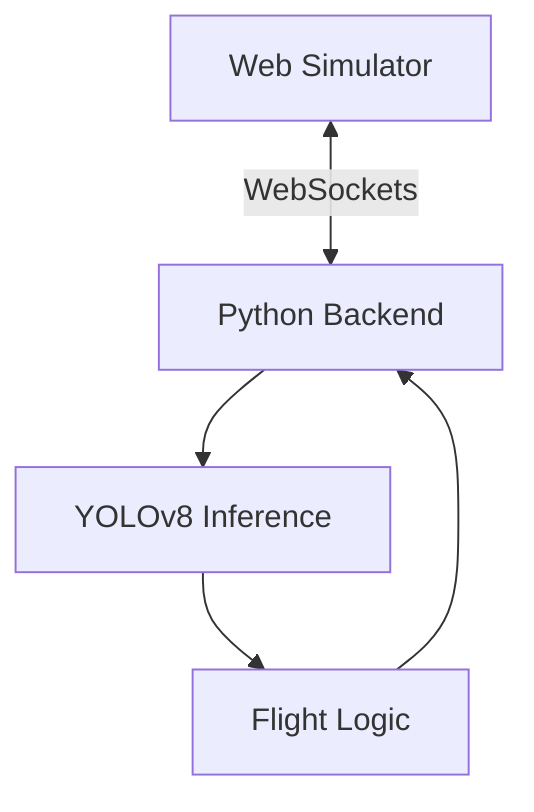

# Tello-Web: Autonomous Drone Simulation

<div align="center">
  
  
  
  
</div>

<p align="center">
  A high-fidelity 3D drone simulator and autonomous control ecosystem.
</p>

---

## Overview
**Tello-Web** is an advanced simulation platform that bridges the gap between virtual testing and real-world DJI Tello autonomous missions. Using **Three.js** for physics and **YOLOv8** for intelligence, it provides a safe, low-latency environment for AI research.

---

## Visual Tour

<div align="center">
  <p><b>Simulator Environment</b></p>
  
</div>

<br />

<div align="center">
  <p><b>AI Computer Vision</b></p>
  
</div>

---

## System Architecture



---

## Key Features

- **Professional Physics:** Real-time drone dynamics powered by Three.js.
- **Autonomous Navigation:** Real-time sign and hazard detection via YOLOv8.
- **Mission Editor:** Dynamic course creation with drag-and-drop support.
- **Low Latency:** Optimized WebSocket bridge for 30 FPS FPV streaming.

---

## Performance

| Metric | Target | Status |
| :--- | :--- | :--- |
| Video Stream | 30 FPS | Stable |
| AI Inference | < 25ms | Real-time |
| Latency | < 10ms | Ultra-low |

---

## Installation

### 1. Web
```bash
npm install && npm run dev
```

### 2. Python
```bash
pip install ultralytics opencv-python websockets numpy
python sim_test.py
```

---

## Controls

| Key | Action |
| :--- | :--- |
| **W / A / S / D** | Movement / Free Look |
| **Q / E** | Altitude Control |
| **T / L** | Takeoff / Land (Python) |

---

<div align="center">
  <sub>Developed by <b>Leansxd</b></sub>
</div>