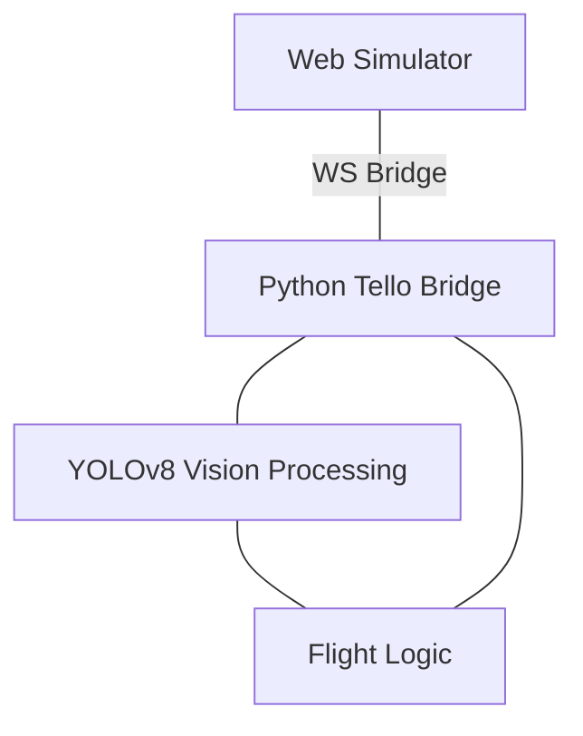

# 🛸 Tello OS: Next-Gen Drone Simulation & AI Ecosystem

  
  
  
  
  

  <b>A professional-grade, high-fidelity 3D drone simulator integrated with YOLOv8 Intelligence.</b> 
  Test autonomous flight logic, computer vision detection, and custom parkour designs in a zero-risk virtual hangar.

---

## 📽️ Visual Journey

  <h3>Simulator Environment</h3>
  
<i>High-fidelity 3D parkour with real-time physics and collision detection.</i>

  

 

  <h3>AI Computer Vision</h3>
  
<i>Real-time YOLOv8 sign detection and autonomous hazard avoidance.</i>

  

---

## ✨ Key Features (v2.0)

- **🚀 Remote Autonomous Launch:** Press **'T'** in the browser to trigger both simulator takeoff and Python AI logic.
- **🚁 Pro-Grade 3D Model:** Integrated a high-detail `.glb` drone model with synchronized propeller animations.
- **🎨 Advanced Object Designer:** Create custom walls with **Elevation (Y-axis)** control for aerial obstacles.
- **🧠 Integrated AI View:** See the processed YOLO frames directly in the web UI sidebar.
- **💡 Interactive Tips System:** Neon-themed guide panel explaining all simulator interactions.
- **📍 Dynamic Waypoint Path:** Neon-dashed route that updates automatically during map editing.

---

## 🏗️ System Architecture

---

## 🎮 Control Center

| Action | Control |
| :--- | :--- |
| **Move Object** | Click + Drag (Ground) |
| **Elevate Object** | **ALT + Click + Drag** (Vertical) |
| **T Key** | Remote Start (Takeoff & AI) |
| **L Key** | Land Drone |
| **F5** | Reset Simulation |

---

## 🚀 Getting Started

1. **Launch Web:** `npm install && npm run dev`
2. **Launch AI:** `python sim_test.py`

---

  <small>Built for Drone Innovation, CV Research & Professional Simulations</small>

