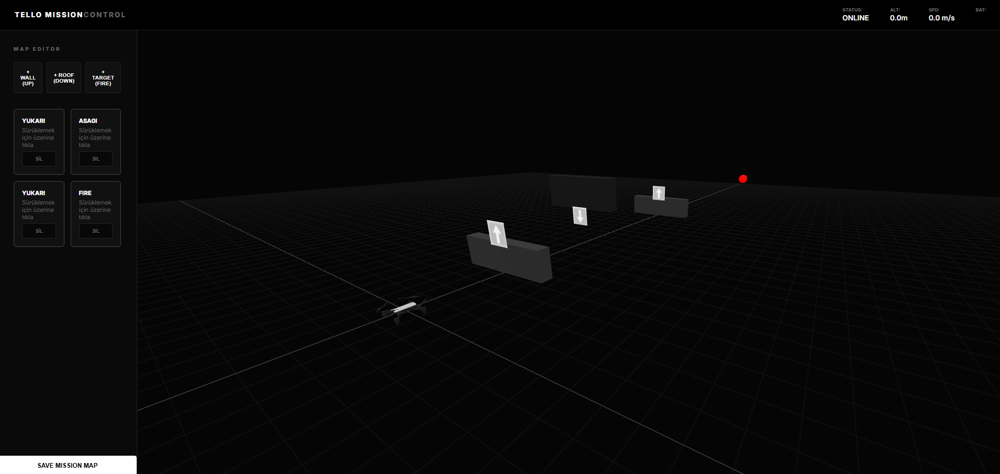
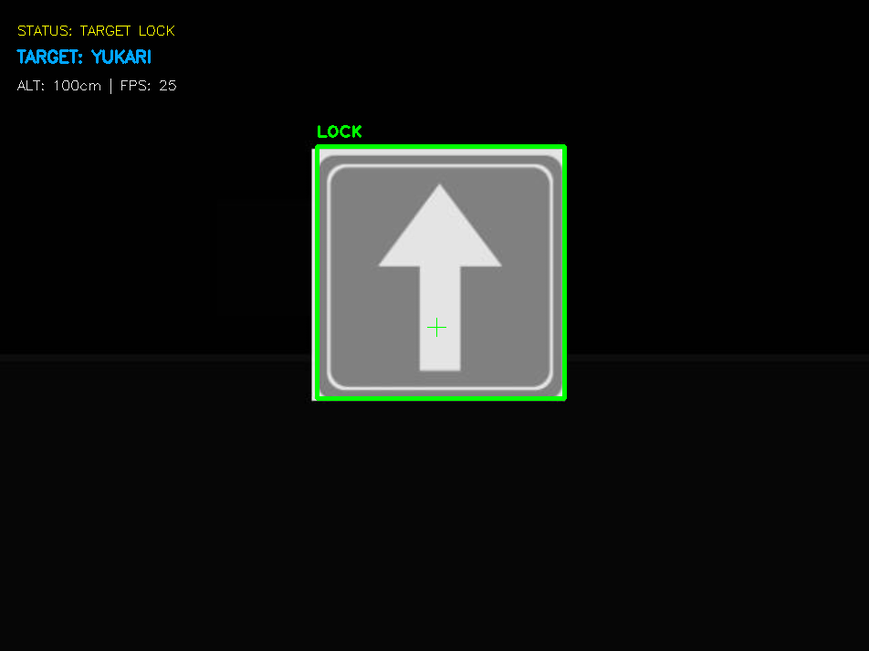

# 🛸 Tello-Web: Autonomous Drone Simulation & Mission Control

<div align="center">
  
  
  
  
  <br />
  
  
</div>

---

### 🌐 Genel Bakış
**Tello-Web**, DJI Tello dronları için geliştirilmiş, yüksek performanslı bir **Three.js** tabanlı 3D simülasyon ortamı ve **YOLOv8** entegreli otonom uçuş kontrol sistemidir. Sanal test ortamı ile gerçek dünya otonom görevleri arasında kusursuz bir köprü kurar.

---

## 📸 Görsel Galeri (Visual Showcase)

<div align="center">
  <table style="width: 100%; border-collapse: collapse; border: none;">
    <tr>
      <td align="center" style="border: none; padding: 10px;">
        <b>🕹️ Profesyonel Simülatör Arayüzü</b><br>
        
      </td>
      <td align="center" style="border: none; padding: 10px;">
        <b>🧠 AI Görü İşleme (YOLOv8)</b><br>
        
      </td>
    </tr>
  </table>
</div>

---

## ✨ Temel Özellikler

### 🎮 Simülasyon ve Kontrol
- **🕹️ Gelişmiş Parkur Simülatörü:** Three.js ile güçlendirilmiş, fizik tabanlı ve akıcı 3D grafikler.
- **🛠️ Görev Düzenleyici (Mission Editor):** Sürükle-bırak ile kendi parkurlarınızı oluşturun, haritaları **LocalStorage** ile kaydedin.
- **🌉 Tello Bridge:** `djitellopy` API'si ile tam uyumlu, Web ve Python dünyasını birleştiren iletişim katmanı.

### 🧠 Otonom Zeka
- **🧠 YOLOv8 Navigasyon:** Yön tabelalarını (Yukarı, Aşağı, Sol, Sağ) ve tehlikeleri (Ateş, Duman) gerçek zamanlı tespit eder.
- **🎥 FPV Canlı Yayın:** Simülatörden Python tarafına WebSockets üzerinden **30 FPS** kesintisiz görüntü aktarımı.
- **🛰️ Otonom Görev Mantığı:** Tespit edilen verilere göre dronun rotasını otonom olarak belirleme yeteneği.

---

## 🚀 Başlangıç Kılavuzu

### 1. Web Simülatörünü Başlatın
Frontend bağımlılıklarını kurun ve geliştirme sunucusunu çalıştırın:
```bash
# Bağımlılıkları yükle
npm install

# Geliştirme sunucusunu başlat
npm run dev
```
Tarayıcınızda [http://localhost:5173](http://localhost:5173) adresini açın.

### 2. Python AI Arka Planını Hazırlayın
Gerekli Python paketlerini yükleyin:
```bash
pip install ultralytics opencv-python websockets numpy
```

### 3. Otonom Uçuşu Başlatın
Web arayüzü çalışırken (Bridge bağlantısı kurulduğunda) şu komutu çalıştırın:
```bash
python sim_test.py
```

---

## 🎮 Kontrol Rehberi

### Simülatör Kamerası
| Tuş | Eylem |
| :--- | :--- |
| **Sol Tık + Sürükle** | Kamerayı Döndür |
| **W / A / S / D** | Hareket (Serbest Bakış) |
| **Q / E** | Yükseklik (Yukarı / Aşağı) |

### Otonom Mod (`sim_test.py`)
- **T:** Kalkış (Takeoff)
- **L:** İniş (Land)
- **Q:** Programı Kapat

---

## 🏗️ Teknoloji Yığını

- **Frontend:** [Vite](https://vitejs.dev/), [Three.js](https://threejs.org/), Vanilla CSS
- **Backend / AI:** Python 3.10+, [Ultralytics YOLOv8](https://ultralytics.com/), OpenCV, WebSockets
- **Modeller:** YOLOv8 Nano (`best.pt` tabelalar için, `fire.pt` tehlike tespiti için)

---

## 🛡️ Güvenlik ve Hata Önleme
Sistem otomatik bir güvenlik mekanizması ile donatılmıştır. Drone şu durumlarda otomatik iniş yapar:
- Pil seviyesi **%10**'un altına düştüğünde.
- Çok yakın bir mesafede kritik bir tehlike (yangın) tespit edildiğinde.

---

> [!TIP]
> **AI Performans Notu:** En iyi tespit sonuçları için simülatördeki kameranın tabelaları net gördüğünden emin olun. Tabelaları dronun rotasına dikey olarak yerleştirmeniz önerilir.

---

<div align="center">
  <sub>Drone Tutkunları ve Yapay Zeka Araştırmacıları için ❤️ ile geliştirildi.</sub>
</div>