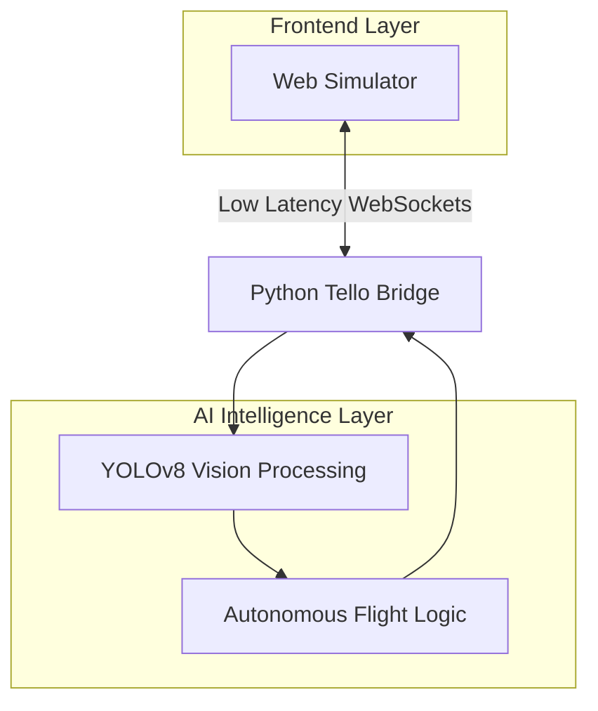

# 🛸 Tello-Web: Autonomous Drone Simulation

<div align="center">
  
  
  
  
</div>

<p align="center">
  <b>A professional-grade 3D drone simulator and autonomous control ecosystem.</b><br />
  Designed for zero-risk testing of AI-driven drone missions and computer vision research.
</p>

---

## 🌐 Overview
**Tello-Web** is a comprehensive simulation platform designed to bridge the gap between virtual development and real-world DJI Tello drone missions. By utilizing **Three.js** for a physics-accurate 3D environment and **YOLOv8** for real-time computer vision, it provides a robust testing ground for autonomous flight algorithms.

---

## 🏗️ Core Components

### 1. 🕹️ 3D Simulator (The Environment)
Built with **Vite** and **Three.js**, the simulator handles accurate flight physics, 720p virtual FPV camera streaming, and a real-time collision system for obstacles and hazards.

### 2. 🧠 Intelligence Layer (The Brain)
The Python-based backend serves as the drone's brain, utilizing **YOLOv8 Nano** to detect directional signs and hazards. It processes incoming video frames and calculates autonomous movement vectors in real-time.

### 3. 🌉 Tello Bridge (The Communication)
A low-latency **WebSocket** layer that synchronizes the Web UI and Python backend. It is API-compatible with `djitellopy`, ensuring a smooth transition to real hardware.

---

## 🖼️ System Architecture



---

## 📽️ Visual Journey

<div align="center">
  <h3>Simulator Environment</h3>
  <p><i>High-fidelity 3D parkour with real-time physics and collision detection.</i></p>
  
</div>

<br />

<div align="center">
  <h3>AI Computer Vision</h3>
  <p><i>Real-time YOLOv8 sign detection and autonomous hazard avoidance.</i></p>
  
</div>

---

## 🛠️ Mission Editor
The built-in editor allows users to create complex parkour courses without coding:
- **Drag-and-Drop:** Intuitive interface for placing walls, signs, and hazards.
- **Map Persistence:** Save and load custom maps to **LocalStorage**.

---

## 🛰️ Autonomous Flight Logic
1. **Frame Capture:** Simulator captures FPV frames from the virtual drone.
2. **Detection:** YOLOv8 analyzes frames to identify directional signs.
3. **Target Locking:** System locks onto signs with high confidence (>0.6).
4. **Maneuvering:** Drone adjusts flight vectors based on sign indicators.
5. **Hazard Avoidance:** Immediate emergency response to fire or smoke detection.

---

## 📊 Performance Specs

| Metric | Target | Status |
| :--- | :--- | :--- |
| Video Stream | 30 FPS | ✅ Stable |
| AI Inference | < 25ms | ✅ Real-time |
| Latency | < 10ms | ✅ Ultra-low |

---

## 🚀 Installation & Usage

### 1. Launch Web Environment
```bash
npm install && npm run dev
```

### 2. Launch Python AI
```bash
pip install ultralytics opencv-python websockets numpy
python sim_test.py
```

---

## 🎮 Control Guide

| Key | Web Action | Python Action |
| :--- | :--- | :--- |
| **W/A/S/D** | Move Camera | Manual Override |
| **Q/E** | Altitude | Hover Logic |
| **T / L** | - | Takeoff / Land |

---

> [!TIP]
> **Technical Note:** For optimal detection, the AI model performs best when directional signs occupy at least 15% of the frame area.

---

<div align="center">
  <sub>Developed with ❤️ by <b>Leansxd</b></sub><br />
  <small>Built for Drone Innovation & AI Research</small>
</div>