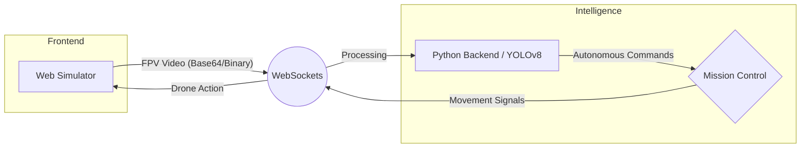

# 🛸 Tello-Web: Autonomous Drone Simulation & Mission Control

<div align="center">
  
  
  
  
  
  <br />
  
  
  
</div>

<p align="center">
  <b>A high-fidelity 3D drone simulator and otonomous control system.</b><br />
  Tested on real-world AI logic, built for the next generation of drone researchers.
</p>

---

## 📍 Quick Navigation
[Overview](#-overview) • [Visual Journey](#-visual-journey) • [System Architecture](#-system-architecture) • [Features](#-key-features) • [Installation](#-getting-started) • [Performance](#-performance-specs)

---

## 🌐 Overview
**Tello-Web** is an advanced simulation ecosystem. It combines the visual power of **Three.js** with the intelligence of **YOLOv8** to create a zero-risk testing ground for DJI Tello autonomous missions.

---

## 📽️ Visual Journey

<div align="center">
  <h3>🕹️ The Simulator Environment</h3>
  <p><i>High-fidelity 3D parkour with real-time physics and collision detection.</i></p>
  
</div>

<br />

<div align="center">
  <h3>🧠 The AI Intelligence</h3>
  <p><i>Real-time YOLOv8 sign detection and hazard avoidance logic.</i></p>
  
</div>

---

## 🏗️ System Architecture



---

## ✨ Key Features

- **🕹️ Pro Simulator:** Real-time physics and drone dynamics.
- **🛠️ Mission Editor:** Drag-and-drop course creation.
- **🧠 YOLOv8 Nav:** Autonomous sign & hazard detection.
- **🎥 Low Latency:** 30 FPS FPV streaming via WebSockets.
- **🛡️ Failsafe:** Auto-land on low battery or fire hazard.

---

## 📊 Performance Specs

| Component | Target | Status |
| :--- | :--- | :--- |
| **Video Streaming** | 30 FPS | ✅ Stable |
| **AI Inference** | < 25ms | ✅ Real-time |
| **WS Latency** | < 10ms | ✅ Ultra-low |
| **Physics Frequency** | 60Hz | ✅ Fluid |

---

## 🚀 Getting Started

### 1. Web Environment
```bash
npm install && npm run dev
```

### 2. Python Environment
```bash
pip install ultralytics opencv-python websockets numpy
python sim_test.py
```

---

## 🎮 Control Guide

| Key | Web Action | Python Action |
| :--- | :--- | :--- |
| **W/A/S/D** | Move Camera | Manual Override |
| **Q/E** | Altitude | Hover Logic |
| **T / L** | - | Takeoff / Land |
| **Delete** | Remove Object | - |

---

<div align="center">
  <h3>🤝 Contributing</h3>
  <p>Found a bug? Have a feature request? Open an issue or submit a PR!</p>
  <a href="https://github.com/Leansxd/tello-web/issues"></a>
  <a href="https://github.com/Leansxd/tello-web/pulls"></a>
</div>

<br />

<div align="center">
  <sub>Developed by <b>Leansxd</b> • Built for Drone Innovation</sub>
</div>